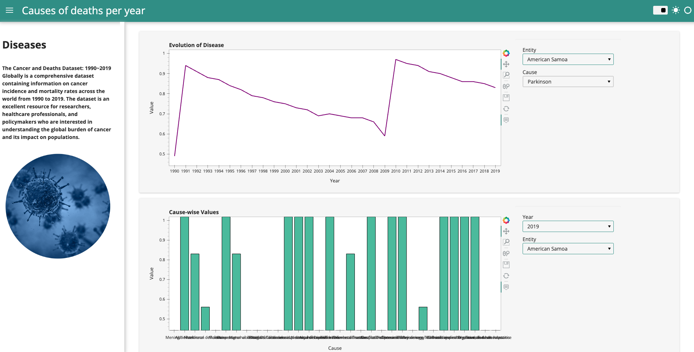

# Healthcare

## Healthcare Data Analysis and Dashboard Building

Table of Contents

- Data
- Exploratory Data Analysis (EDA)
- Dashboard Building

Data
[`Kaggle data`](https://www.kaggle.com/datasets/belayethossainds/cancer-and-deaths-dataset-19902019-globally)

Exploratory Data Analysis (EDA)
[`Death_cause_1990_2019`](https://github.com/odartsi/Healthcare/blob/main/Cancer_deaths_EDA/Cancer_deaths_1990_2019.ipynb)

Dashboard Building
[`Healthcare_dashbord`](https://github.com/odartsi/Healthcare/blob/main/Cancer_deaths_EDA/Healthcare_dashboard.ipynb)

